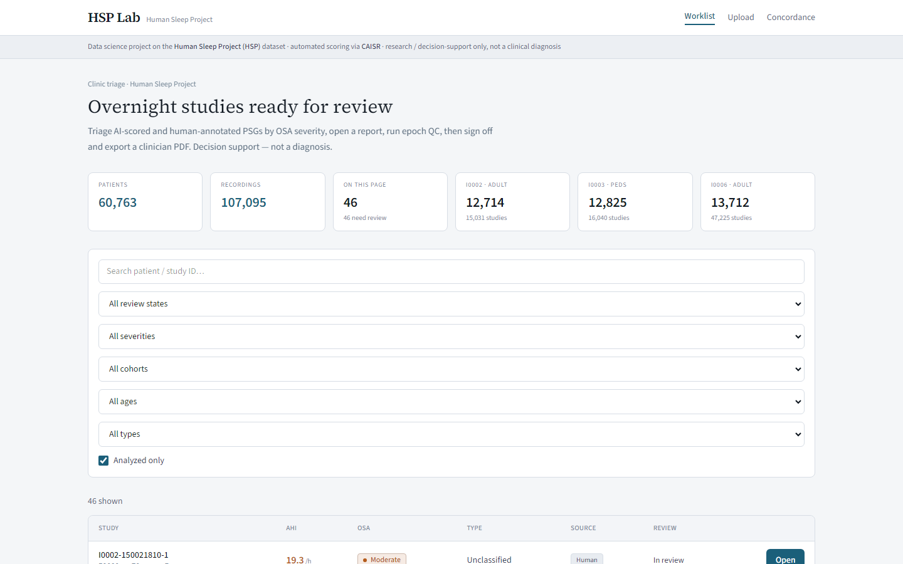
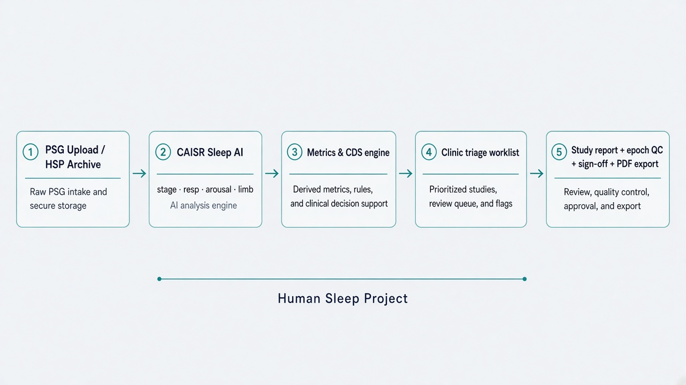
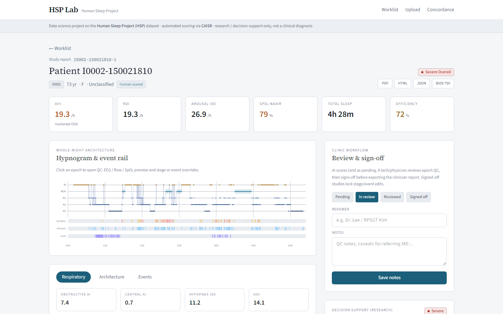
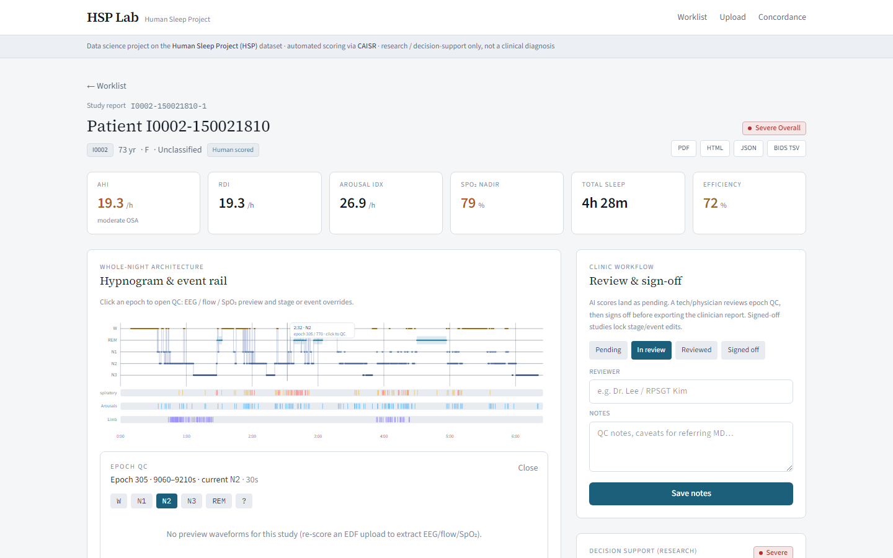
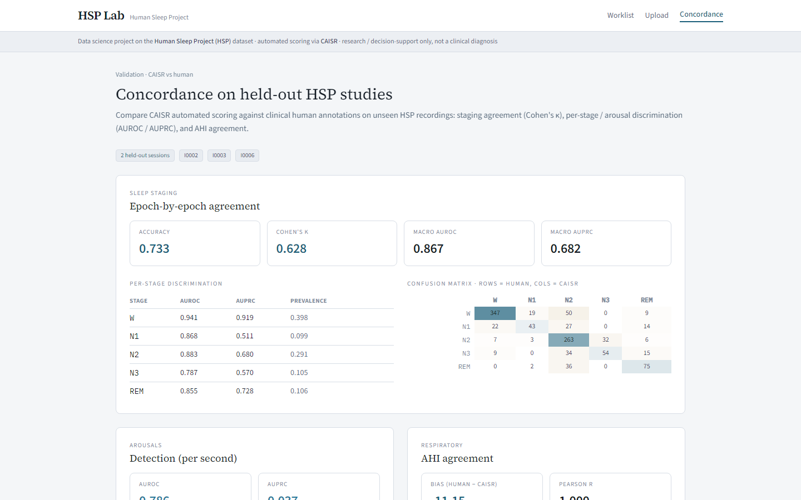
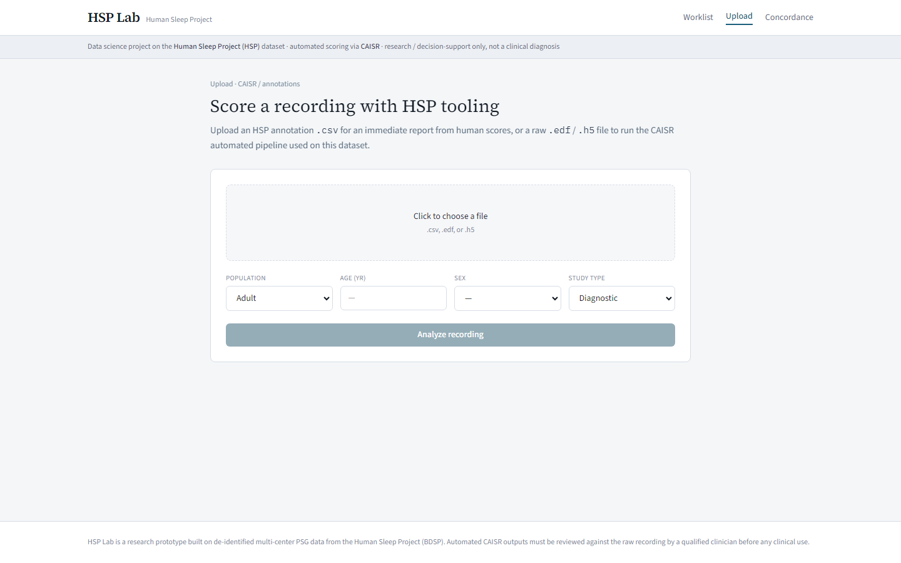

# HSP Lab — Sleep Clinic AI Dashboard

**CAISR-backed triage and clinical decision support** over
[Human Sleep Project](https://bdsp.io) (HSP) polysomnography — plus a clinic-style
review loop (queue → epoch QC → sign-off → PDF export).

> Research / decision-support prototype. Not a medical device and **not a diagnosis**.
> Automated scores must be verified against the raw PSG by a qualified clinician.

<p align="center">
  
</p>

<p align="center"><em>Clinic triage worklist — AHI, OSA severity, review state, Open.</em></p>

---

## Is this useful for sleep clinics?

**Yes, for a specific job:** reviewing AI-scored (or human-annotated) overnight
studies faster — triage by severity, inspect hypnogram + events, override epochs,
sign off, and export a clinician report.

| Clinic need | HSP Lab today |
| --- | --- |
| Overnight queue / triage by AHI & OSA severity | Worklist with severity + review filters |
| Read a scored report (AHI, SpO₂, architecture) | Study workspace + CDS panel |
| Light QC of suspicious epochs | Click hypnogram → EEG/flow/SpO₂ + stage/event overrides |
| Reviewer accountability | Pending → In review → Reviewed → Signed off (+ notes) |
| Hand-off artifacts | PDF / HTML / JSON / BIDS-Events TSV |
| Trust / validation slide | Concordance (κ, AUROC, AHI Bland–Altman) on held-out HSP sites |
| Replace RemLogic / Noxturnal scoring station | **No** — not a full-montage PSG editor |
| Hospital auth, EMR, orders, PHI | **No** — de-identified research demo only |

So: useful as an **AI scoring review console** and research demonstrator. Not a
turnkey EHR-integrated scoring lab.

---

## Live demo

Run locally (no S3 required when you use sample studies):

```powershell
# API  :8000
$env:PYTHONPATH="packages/psg_core"
.\.venv\Scripts\python -m uvicorn app.main:app --app-dir apps/api --host 127.0.0.1 --port 8000

# Web  :3000
cd apps/web
npm run build
npm start
```

Then open **http://localhost:3000**

| Path | What to try |
| --- | --- |
| `/` | Filter by OSA severity / review state; open a study |
| `/study/<uid>` | Hypnogram click → Epoch QC; Review & sign-off; Export PDF |
| `/upload` | Drop HSP `.csv` (instant) or `.edf` (needs CAISR Docker) |
| `/concordance` | κ / AUROC / Bland–Altman vs human on held-out HSP |

Offline demo data (already in a local `data/` cache, or regenerate):

```powershell
python scripts/make_sample_data.py --n 30
```

---

## Visual tour

### Architecture

<p align="center">
  
</p>

```
  PSG upload / HSP archive
            │
            ▼
     CAISR Sleep AI  ──►  stage · respiratory · arousal · limb
            │
            ▼
   Metrics + CDS (psg_core)  ──►  AHI, SpO₂, severity, findings
            │
            ▼
   Clinic triage → Study report → Epoch QC → Sign-off → PDF/BIDS
```

### Study report

<p align="center">
  
</p>

<p align="center"><em>Hypnogram + event rails, key indices, Review &amp; sign-off, CDS.</em></p>

### Epoch QC

<p align="center">
  
</p>

<p align="center"><em>Click an epoch for waveform preview and stage / event overrides (locked after sign-off).</em></p>

### Concordance (validation)

<p align="center">
  
</p>

<p align="center"><em>Held-out HSP sites: Cohen’s κ, per-stage AUROC/AUPRC, AHI Bland–Altman.</em></p>

### Upload

<p align="center">
  
</p>

---

## Quick start

**Prerequisites:** Python 3.10+, Node 20+. Docker + CAISR images only if you score raw EDF/H5.
AWS CLI + BDSP credentials only if you pull real HSP annotations from S3.

```powershell
python -m venv .venv
.\.venv\Scripts\pip install -r requirements.txt

python scripts/build_registry.py
python scripts/make_sample_data.py --n 30          # offline demo
# — or —  python scripts/build_cache.py --per-cohort 8   # real HSP (S3)

$env:PYTHONPATH="packages/psg_core"
.\.venv\Scripts\python -m uvicorn app.main:app --app-dir apps/api --port 8000

cd apps/web
npm install
npm run dev    # http://localhost:3000  (proxies /api → :8000)
```

CAISR Docker setup: [`docker/README.md`](docker/README.md).

---

## Stack

| Layer | Path | Role |
| --- | --- | --- |
| Shared PSG logic | `packages/psg_core` | Annotations, AASM metrics, CDS, SpO₂ enrichment, export |
| API | `apps/api` | Worklist, study, review lifecycle, uploads, CAISR jobs |
| Web | `apps/web` | Next.js 15 triage console |
| Scripts | `scripts/` | Registry, S3 cache, sample data, concordance eval |
| Sleep AI | `docker/` | CAISR preprocess → stage/arousal/resp/limb → report |

Per-study artifacts under `data/studies/<uid>/`:

`meta` · `hypnogram` · `events` · `metrics` · `summary` · optional `signals` / `comparison` / `overrides`

---

## Clinic review workflow

1. **Triage** — worklist sorted / filtered by OSA severity and review status  
2. **Open** — AHI, SpO₂ nadir/ODI (waveform-filled when CAISR omits them), hypnogram  
3. **QC** — click epoch → override stage or remove events; metrics recompute  
4. **Sign off** — lock edits; export clinician PDF / BIDS TSV  
5. **Validate** — concordance page for site-level κ and AHI agreement  

Provenance (CAISR images, sanitize steps, `psg_core` version) is stored on each study.

---

## Clinical safety

Every report carries an explicit disclaimer. Pediatric thresholds, split-night /
titration caveats, and insufficient-sleep guards are applied in CDS. Signed-off
studies refuse further stage/event edits until reopened.

---

## License & data

Code in this repository is for research demonstration. HSP recordings remain
subject to [BDSP](https://bdsp.io) data-use agreements — do not commit PHI or
raw EDF corpora. `data/` and `metadata/*.csv` are gitignored by default.
